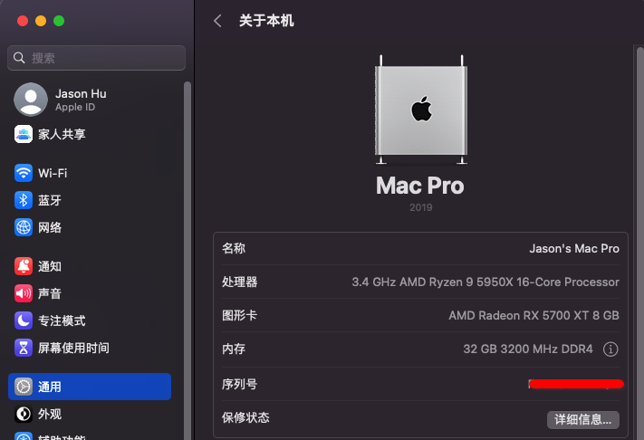
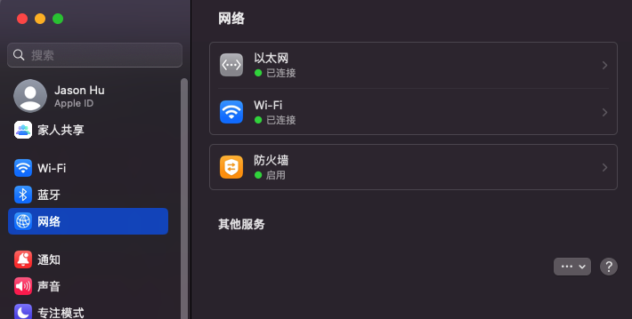
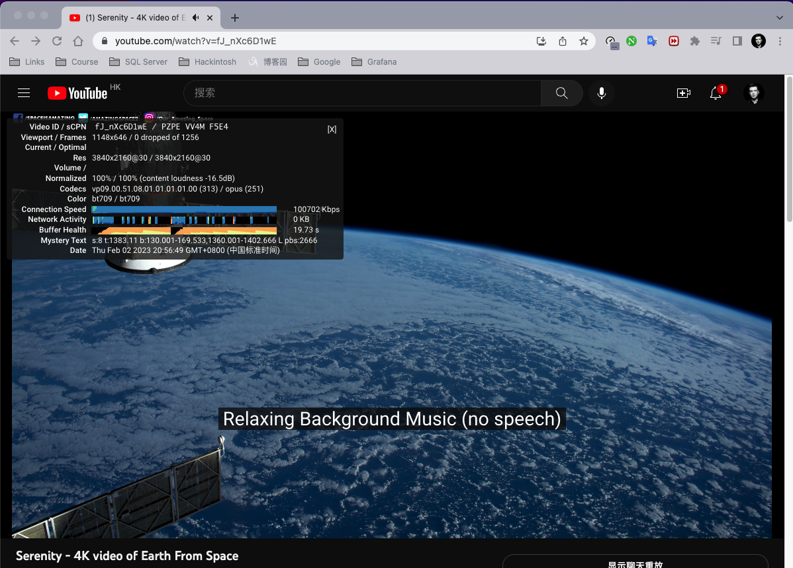
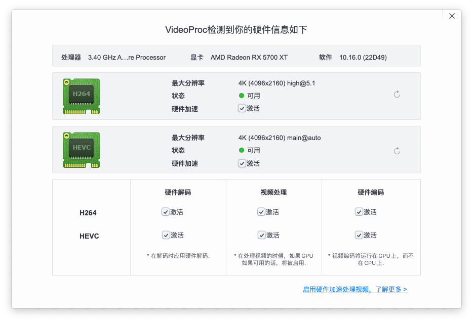
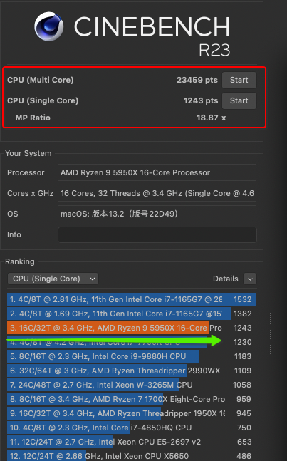

### Hackintosh on AMD Platform

#### System info

```yaml
macOS Version: 13.2
AMD Ryzen 9 5950X 16-Core Processor
Family: 19h, Model: 03h
Physical: 16, Logical: 32
L1(Total): 1024 KB, L2(Total): 8 MB, L3(Shared): 64 MB
## 
Motherboard: ROG STRIX X570-I GAMING @ASUSTeK COMPUTER INC.
Graphics: AMD Radeon RX 5700 XT
Memory: 32GB, Storage: 465GB
```

#### BIOS SITTINGS

- **Load defaults settings first**

- `SVM`: enabled
- `Above-4G decoding`: enabled

- `Security boot` ->`disabled`
- ` Fast boot`->` disabled`
- `CSM`-> `disabled`
- `Network stack`->` disabled` (disable PXE)

> EFI

- [x570i-5950x-rx5700-eth0-wifi-Ventura-13.2.zip](http://alist.bo.ms/d/share/hackintosh/EFI/x570i-5950x-rx5700-eth0-wifi-Ventura-13.2.zip?sign=1EWGvZoDzirFwzEHoYZAUKJh_jAkHXBYApQGrS4C1Ng=:0)

> screenshot














