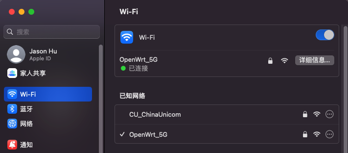

### Hackintosh on AMD Platform

#### System info

```yaml
macOS Version: 13.2
AMD Ryzen 9 5950X 16-Core Processor
Family: 19h, Model: 03h
Physical: 16, Logical: 32
L1(Total): 1024 KB, L2(Total): 8 MB, L3(Shared): 64 MB
## 
Motherboard: ROG STRIX X570-I GAMING @ASUSTeK COMPUTER INC.
Graphics: AMD Radeon RX 5700 XT
Memory: 32GB, Storage: 465GB
```

#### BIOS SITTINGS

- **Load defaults settings first**

- `SVM`: enabled
- `Above-4G decoding`: enabled

- `Security boot` ->`disabled`
- ` Fast boot`->` disabled`
- `CSM`-> `disabled`
- `Network stack`->` disabled` (disable PXE)

##### EFI

- [x570i-5950x-rx5700-eth0-wifi-Ventura-13.2.zip](EFI/x570i-5950x-rx5700-eth0-wifi-Ventura-13.2.zip)

##### Drivers

###### Ethernet: 

- https://github.com/donatengit/AppleIGB/ 

  >  **`AppleLGB`**

  Basically it can be worked, but it disconnected sometimes with no reason, To enable it you have to `make sure Above-4G decoding enabled` in `BIOS` and don't forget to remove `npci=0x2000` in `boot-args`

- https://github.com/acidanthera/IntelMausi (doesn't work on my machine)

- https://github.com/khronokernel/SmallTree-I211-AT-patch (doesn't work on my machine)


###### Intel AX200

- WIFI: https://github.com/OpenIntelWireless/itlwm

  

  

- Bluetooth: https://github.com/OpenIntelWireless/IntelBluetoothFirmware (`not work for now`)

###### Dell DW 1820A

- WIFI (`Perfectly working and speed surrised me, Intel WIFI have speed issue `)

  - https://github.com/acidanthera/AirportBrcmFixup

  

  

  

- Bluetooth (` Connection is good but Airdrop only could be discovered by other machine, itself can't discover by other machine`)

  https://github.com/acidanthera/BrcmPatchRAM

  

  

##### Screenshots


