## Hackintosh installation tutorial

### Hardware & BIOS Settings

#### Hardware

- `Motherboard`: `ASUS ROG B360-i`
- `CPU`: `I9-9700`
- `GPU`: `AMD-RX590`
- `Broadcom`：`BCM94360Z3`
- `SSD`: `Kingston 512GB`

#### BIOS Settings

- Disabled
  - Fast Boot
  - Secure Boot
  - Compatibility Support Module (CSM) (**Must be off in most cases, GPU errors/stalls like `gIO` are common when this option is enabled**)
  - Intel SGX
  - Intel Platform Trust
  - CFG Lock (MSR 0xE2 write protection)(**This must be off, if you can't find the option then enable `AppleXcpmCfgLock` under Kernel -> Quirks. Your hack will not boot with CFG-Lock enabled**)
- Enabled
  - VT-d 
  - VT-X
  - Above 4G Decoding
  - Hyper-Threading
  - EHCI/XHCI Hand-off
  - OS type: Windows 8.1/10 UEFI Mode (some motherboards may require "Other OS" instead)
  - DVMT Pre-Allocated(iGPU Memory): 128MB
  - SATA Mode: AHCI

### macOS Install image Download

- https://blog.daliansky.net/
- Self-build

### OpenCore

- [OpenCore Bootloader](https://github.com/acidanthera/OpenCorePkg/releases)

- [OpenCore Driver](https://dortania.github.io/OpenCore-Install-Guide/ktext.html)

- [OpenCore editor](https://github.com/ic005k/OCAuxiliaryTools)

- OpenCore config checker

  - [https://opencore.slowgeek.com/](https://opencore.slowgeek.com/)  (only supported `OC version up to 0.6.6`)

    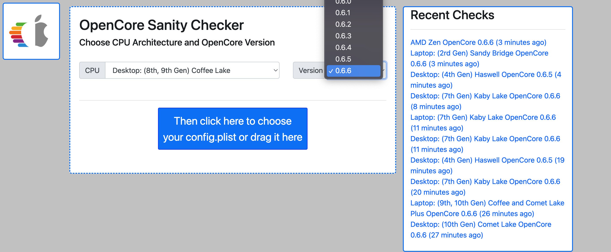

  - [https://sc.ocutils.me/](https://sc.ocutils.me/) (supported all `OC` versions)

    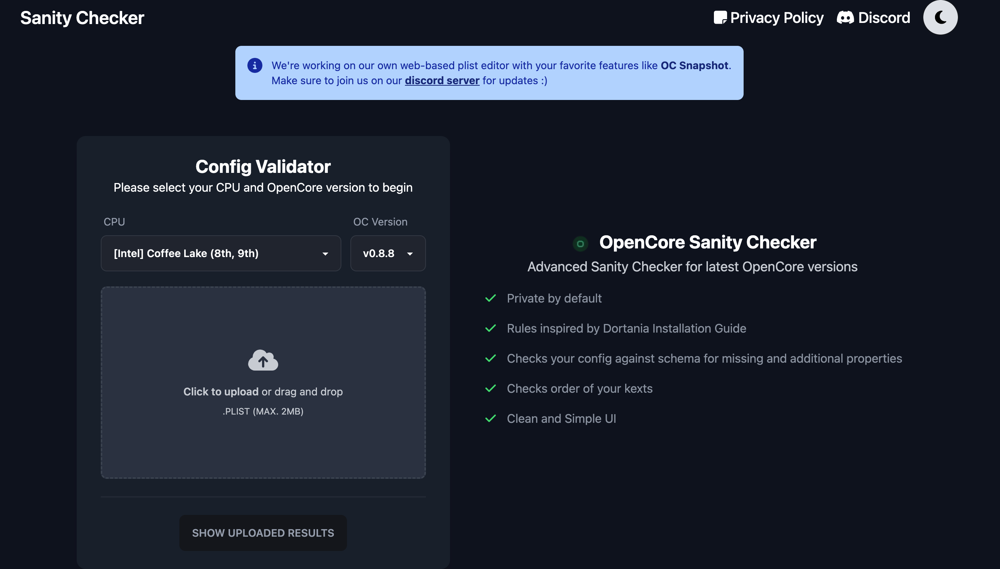

- OpenCore Theme

  - [Big Sur Theme](https://github.com/LuckyCrack/OpenCore-Themes) (tested running on below 0.7.8 version perfectly fine, 0.8.8 have issues)
  - [Flavours-macIOS.zip](archive/Flavours-macIOS.zip) (perfectly fine running on latest opencore)

### Tools

- [Diskgenius](https://clamowo.lanzoui.com/b05agns3g)
- [Easyuefi](archive/Flavours-macIOS.zip)
- [balenaEtcher](https://www.balena.io/etcher/)
- [OCAuxiliaryTools](https://github.com/ic005k/OCAuxiliaryTools)
- [GenSMBIOS](https://github.com/corpnewt/GenSMBIOS)
- [OCC](https://mackie100projects.altervista.org/download/occ/?wpdmdl=811&refresh=63c36fc46bd111673752516)
### Config configuration tutorial:

- [Desktop Coffee Lake](https://dortania.github.io/OpenCore-Install-Guide/config.plist/coffee-lake.html)
- [Desktop Comet Lake](https://dortania.github.io/OpenCore-Install-Guide/config.plist/comet-lake.html)
- [Ryzen and Threadripper(17h and 19h)](https://dortania.github.io/OpenCore-Install-Guide/AMD/zen.html)

### Issues & FAQ

- Asus 300 series motherboard may have `F1` issue when boot each time:

  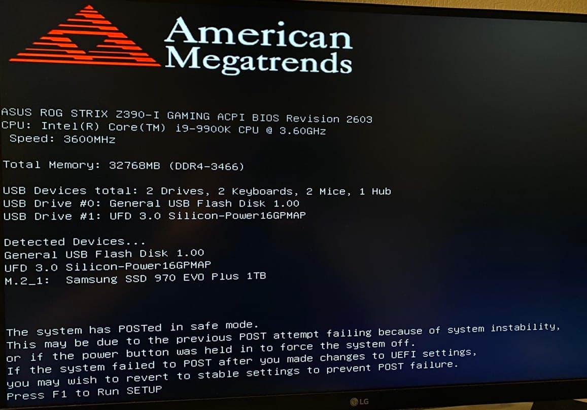

  **Fix solution**:

  - `ACPI`->`Patch` (Use `OpenCore Configurator` just right click it will show the patch at the bottom menu)

    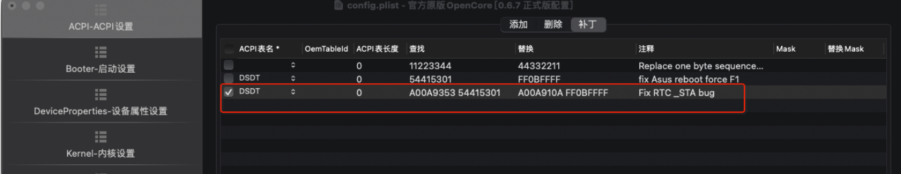

  - `kernal`->`patch`

    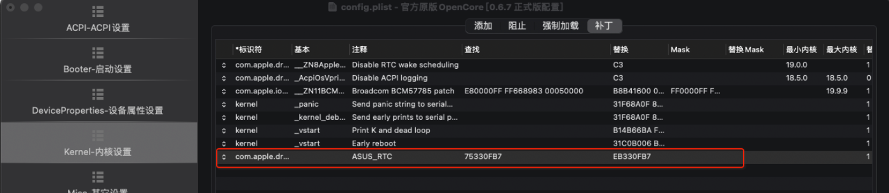

  - `Kernel`->`add`

    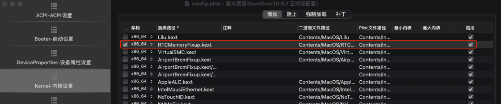

### Opencore bootloader

---

Most important thing we all care about  is the  `EFI` file, **This is the perfectly running on my machine including everything I can say it’s 100% perfection, everything fountion well**, *not guarantee can perfectly run on any other machine.*

**[OpenCore EFI-Asus-I7-9700-RX590-13.1](archive/Asus-I7-9700-RX590-13.1.zip)**

---

### Finnal work

- Screenshots

  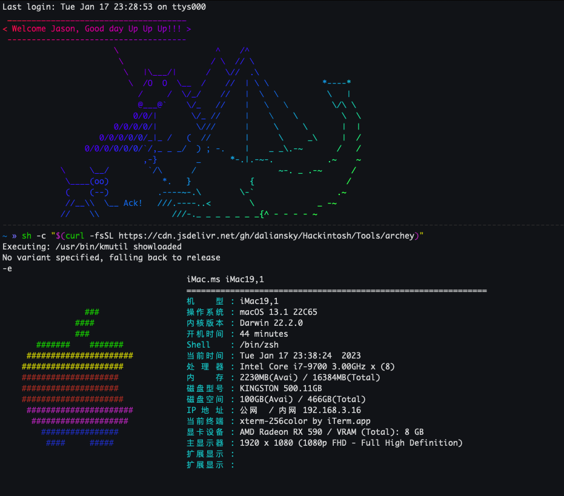

  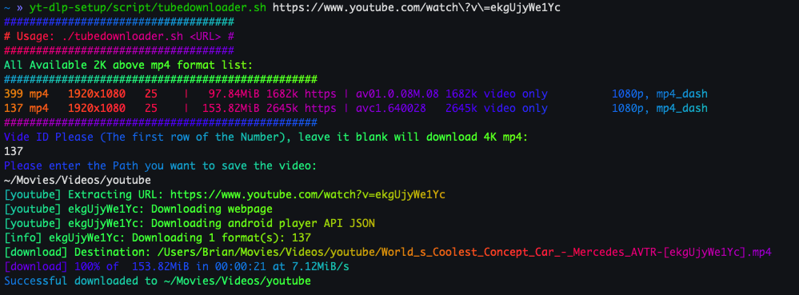

  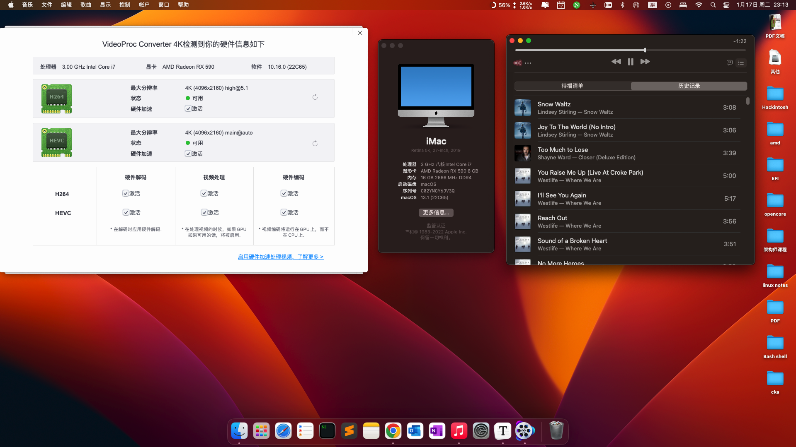

  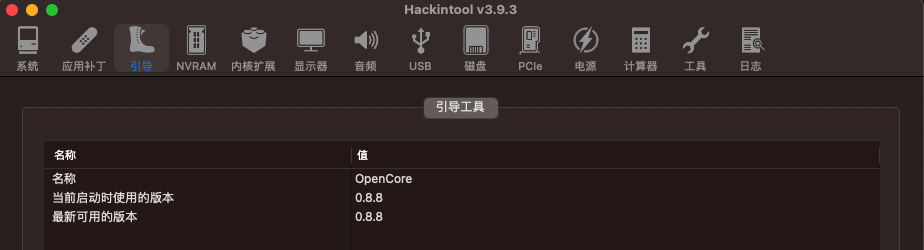

  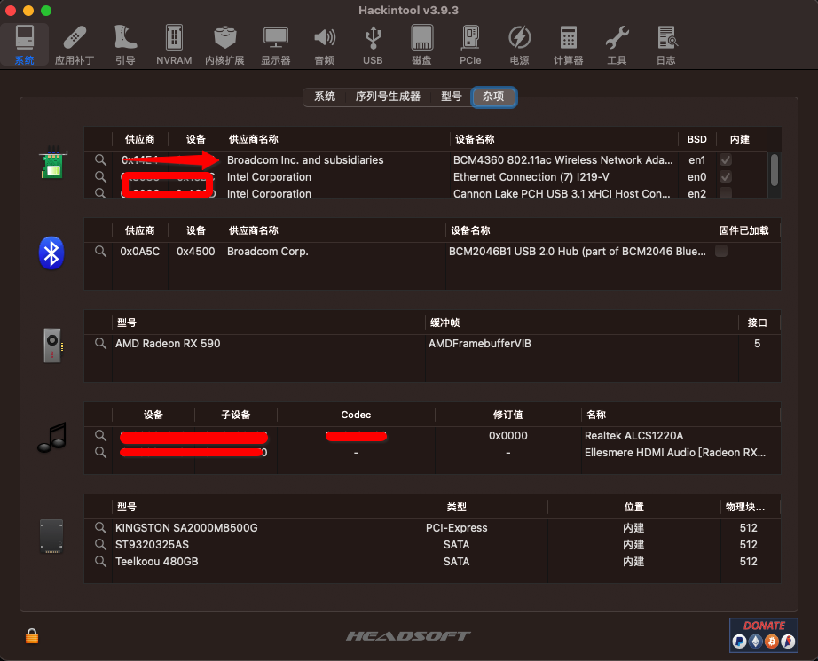
  
  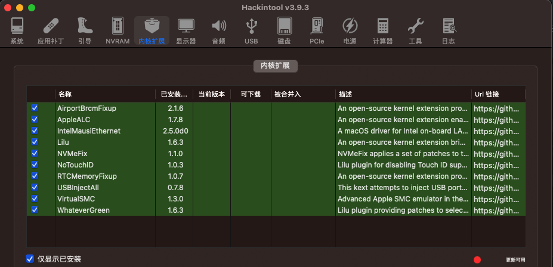
  
  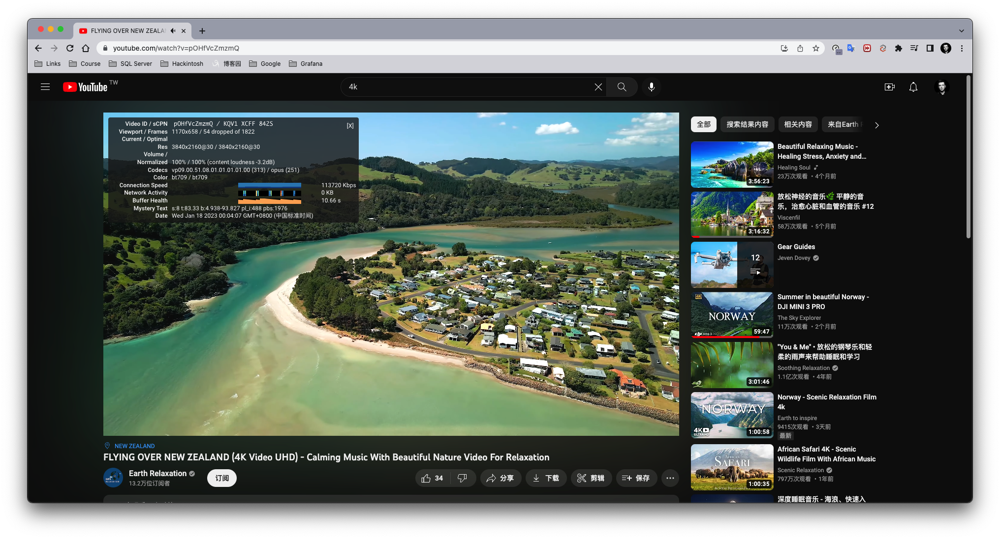
  
  
  
  My earlier tutorial : 
  
  - [https://www.cnblogs.com/aboa/p/14594968.htm](https://www.cnblogs.com/aboa/p/14594968.html)
  - [https://oss.msft.vip/Hackintosh/](https://oss.msft.vip/Hackintosh/)
  - [https://oss.msft.vip/2023/01/15/hackintosh/](https://oss.msft.vip/2023/01/15/hackintosh/)

